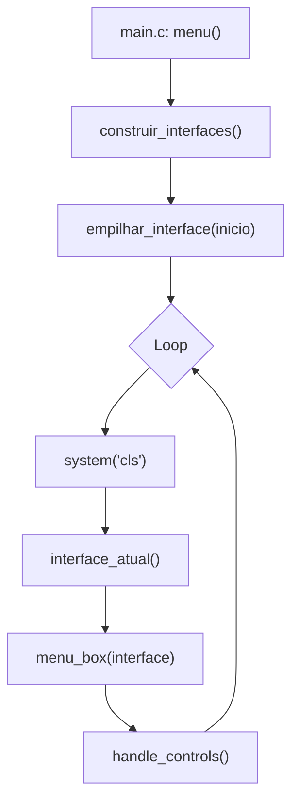
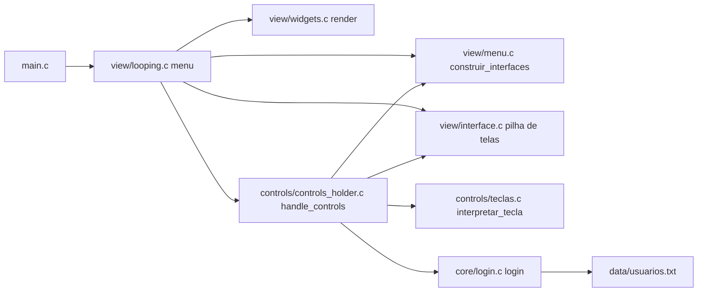

# HelpDesk (C - Console)

Aplicativo de console para um fluxo simples de Help Desk com menus navegáveis via teclado, interface de texto com cores/ASCII-art e autenticação básica de atendente por arquivo.

## Sumário
- **[Arquitetura e Fluxo](#arquitetura-e-fluxo)**
- **[Estrutura de Diretórios](#estrutura-de-diretórios)**
- **[Módulos e Comunicação](#módulos-e-comunicação)**
- **[Como Compilar e Executar](#como-compilar-e-executar)**
- **[Controles do Teclado](#controles-do-teclado)**
- **[Interface de Usuário (Widgets)](#interface-de-usuário-widgets)**
- **[Autenticação (Login)](#autenticação-login)**
- **[Extensão do Sistema](#extensão-do-sistema)**
- **[Erros/Observações Conhecidas](#errosobservações-conhecidas)**

## Arquitetura e Fluxo
O programa é organizado em camadas:

- **view/**: gerenciamento de interfaces, menus e renderização (UI de console).
- **controls/**: leitura e interpretação do teclado, navegação e disparo de ações.
- **core/**: regras de negócio básicas (ex.: login de atendentes).
- **data/**: dados externos, como o arquivo de usuários.

Fluxo principal:



- O loop de `menu()` (em `src/view/looping.c`) redesenha a tela e processa entradas continuamente.
- A pilha de interfaces permite navegar para frente/voltar entre telas (`src/view/interface.*`).
- A renderização usa funções de widgets (`src/view/widgets.c`).
- As teclas são lidas/interpretadas em `src/controls/teclas.c` e processadas em `src/controls/controls_holder.c`.

## Estrutura de Diretórios

```
HelpDesk/
├─ CMakeLists.txt
├─ main.c
└─ src/
   ├─ core/
   │  ├─ atendimento.c
   │  ├─ atendimento.h
   │  ├─ fila_normal.c
   │  ├─ fila_normal.h
   │  ├─ fila_preferencial.c
   │  ├─ fila_preferencial.h
   │  ├─ login.c
   │  └─ login.h
   ├─ controls/
   │  ├─ controls_holder.c
   │  ├─ controls_holder.h
   │  ├─ teclas.c
   │  └─ teclas.h
   ├─ data/
   │  └─ usuarios.txt
   └─ view/
      ├─ acoes.c
      ├─ acoes.h
      ├─ interface.c
      ├─ interface.h
      ├─ looping.c
      ├─ looping.h
      ├─ menu.c
      ├─ menu.h
      ├─ widgets.c
      └─ widgets.h
```

## Módulos e Comunicação

- **`main.c`**
  - Ponto de entrada. Chama `menu()` definido em `src/view/looping.c`.

- **`src/view/looping.c`**
  - Define o loop principal `menu()`.
  - Estados globais da UI: `opcao_selecionada`, `ultima_tecla`, `user`, `pass` (exportados via `looping.h` e `controls_holder.h`).
  - Constrói interfaces via `construir_interfaces()` e empilha a tela inicial `obter_inicio()`.
  - Loop: limpa a tela, obtém `interface_atual()`, chama `menu_box()` para renderizar e `handle_controls()` para processar entrada.

- **`src/view/interface.*`**
  - Estruturas: `Interface`, `Opcao`, `TipoMenu` (`LOGIN`, `SELECAO`, `LISTA`).
  - Gerencia a pilha de interfaces (`empilhar_interface`, `desempilhar_interface`, `interface_atual`, `voltar`).
  - Criação de UI em tempo de execução (`criar_interface`, `criar_opcao`).

- **`src/view/menu.*`**
  - Constrói as telas e encadeia suas opções.
    - `inicio`: seleção entre Cliente/Atendente/Sair.
    - `menu_cliente`: opções atuais — "Iniciar Atendimento", "Atender pedidos" (requer adm=1), "Ver meus atendimentos", "Sair".
    - `form_login`: formulário com campos `Usuario` e `Senha`.
  - Ações (callbacks) expostas/úteis: `abrir_menu_principal`, `abrir_login`, `voltar_inicio`, `sair_sistema`.
  - Exposta função `obter_inicio()` para o loop.

- **`src/view/widgets.*`**
  - Renderiza a UI (ASCII/cores) e as opções, incluindo cabeçalhos e caixas.
  - `menu_box(Interface*)` decide como desenhar a interface conforme `TipoMenu`.
    - `LOGIN`: duas linhas para `Usuario` e `Senha` (senha mascarada com `*`).
    - `SELECAO`: lista de opções com destaque na selecionada.
    - `LISTA`: reservado para futuras listas; sem renderização específica no momento.
  - Exibe usuário logado e data via `print_usuario_com_data()`.

- **`src/controls/teclas.*`**
  - Lê o teclado de forma cross-platform (Windows via `<conio.h>`, Unix via termios).
  - Converte scancodes em enum `Tecla` (`SETA_CIMA`, `SETA_BAIXO`, `SETA_ESQ`, `SETA_DIR`, `TECLA_ESC`, `TECLA_SAIR`, `TECLA_NORMAL`).
  - Preenche `ultima_tecla` para entrada de caracteres.

- **`src/controls/controls_holder.*`**
  - Função central `handle_controls()` executa a ação conforme a tecla interpretada:
    - Navegação entre opções (`opcao_selecionada`).
    - Voltar/Sair: `SETA_ESQ` chama `voltar()`; `ESC`/`'q'` sai, exceto em `LOGIN`, onde volta e limpa os campos.
    - No formulário de login: digitação em `user`/`pass`, backspace, e confirmação com `SETA_DIR`.
    - Ao confirmar (`SETA_DIR`) em `LOGIN`: se `login(user, pass)` for bem-sucedido, abre o menu principal do cliente (`abrir_menu_principal()`), limpa `user`/`pass` e reseta seleção; em falha, limpa apenas `pass`.
    - Em menus de seleção (`SELECAO`), ao confirmar, busca a `Opcao` selecionada e chama o callback `f()`.
    - Teclas numéricas (`0-9`): atualmente disparam a ação da opção selecionada (não selecionam por número).

- **`src/core/login.*`**
  - Lê `../src/data/usuarios.txt` com pares `usuario senha`.
  - Valida credenciais e define `usuario_logado` global.
  - `get_logged()` indica se há usuário autenticado.
  
- **`src/core/atendimento.*`**
  - Define o tipo `Atendimento` (descrição, prioridade 1-4, nome da pessoa, `struct tm data_hora`).
  - Função `atendimento_create()` para construir instâncias válidas.

- **`src/core/fila_preferencial.*`**
  - Implementa `FilaPrioridadeMaxima` (heap máximo) de `Atendimento` por prioridade e data/hora.
  - Operações: `criar_fila_prioridade_maxima`, `inserir`, `extrair_maximo`, `liberar_fila`.

- **`src/core/fila_normal.*`**
  - Arquivos presentes (estrutura reservada para fila FIFO). Implementação ainda vazia.

- **`src/data/usuarios.txt`**
  - Formato simples por linha: `Usuario Senha` (separados por espaço). Exemplo:
    ```
    Enzo 123
    Izabely 321
    ```

### Diagrama de Relações (alto nível)


## Como Compilar e Executar

### CLion (Windows)
- Abra o diretório do projeto no CLion.
- O CMake do projeto já aponta todas as fontes em `CMakeLists.txt`.
- Build e Execute a configuração padrão `HelpDesk`.

### Linha de comando (CMake)
Requer CMake e um compilador C (GCC/Clang/MinGW/ MSVC). Exemplo usando a pasta `build`:

```bash
cmake -S . -B build -DCMAKE_BUILD_TYPE=Release
cmake --build build --config Release
./build/HelpDesk
```

No Windows com MSVC/MinGW, o executável pode estar em `build/Release/HelpDesk.exe`.

## Controles do Teclado
- **[Seta Cima] / [Seta Baixo]**: navega entre opções.
- **[Seta Direita / Enter]**: confirma a opção; no formulário, tenta login.
- **[Seta Esquerda]**: volta para a tela anterior.
- **[ESC] / 'q'**: sai; em formulário de login, volta e limpa campos.
- **[Backspace]**: apaga último caractere (nos campos do formulário).
- **Caracteres imprimíveis**: digitam nos campos `Usuario` e `Senha` quando selecionados.
- **[0-9]**: atualmente executa a opção selecionada (não seleciona por número).

## Interface de Usuário (Widgets)
- UI usa sequências ANSI de cores (pode exigir um console compatível).
- `menu_box()` desenha:
  - Cabeçalho com título e instruções.
  - Se `TipoMenu = LOGIN`: duas linhas para `Usuario` e `Senha` (senha exibida com `*`).
  - Se `TipoMenu = SELECAO`: lista de opções com destaque na selecionada.
  - Se `TipoMenu = LISTA`: reservado para uso futuro.

## Autenticação (Login)
- Apenas o menu de Atendente exige login (usuário/senha).
- Fonte de dados: `src/data/usuarios.txt`.
- Em caso de sucesso:
  - `usuario_logado` é definido em `core/login.c`.
  - A UI passa a exibir o nome do usuário logado no topo.
  - Abre o menu principal do cliente e os campos são limpos.
 - Em caso de falha: o campo de senha é limpo.

## Extensão do Sistema

- **Adicionar uma nova tela/menu**
  - Crie uma `Interface* nova = criar_interface("Titulo", SELECAO|LOGIN);`.
  - Encadeie opções com `criar_opcao("Nome", opcaoAnteriorOuNULL, callback);`.
  - Atribua `nova->primeira_opcao = primeiraOpcao;`.
  - Exponha uma função para abrir: `void abrir_nova() { empilhar_interface(nova); }`.
  - Registre a entrada no menu anterior com uma `Opcao` que chama `abrir_nova`.

- **Adicionar ação a uma opção**
  - Use callbacks do tipo `typedef void (*Funcao)();` (ver `interface.h`).
  - No `controls_holder.c`, ao confirmar (`SETA_DIR`), a função `f()` da opção selecionada é chamada.

- **Adicionar validação extra no login**
  - Estenda `core/login.c` (ex.: regex, politicas de senha, bloqueio após tentativas, etc.).

- **Persistência de dados**
  - Hoje, o login lê somente `usuarios.txt`. Novos dados podem ser armazenados em arquivos adicionais em `src/data/`.

## Erros/Observações Conhecidas

- **Teclas numéricas**: a interface imprime instrução para escolher por número, porém a implementação atual apenas executa a opção já selecionada quando uma tecla numérica é pressionada. Seleção por número ainda não está implementada.
- **TipoMenu LISTA**: tipo definido e reconhecido por `widgets.c`, mas sem renderização específica no momento.
