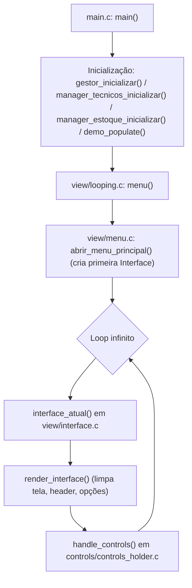
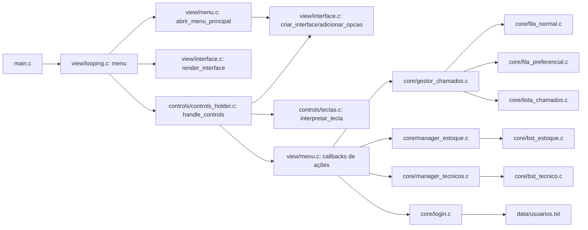

# HelpDesk (C - Console)

Aplicativo de console para um fluxo simples de Help Desk com menus navegáveis via teclado, interface de texto com cores/ASCII-art e autenticação básica de atendente por arquivo.

## Sumário
- **[Arquitetura e Fluxo](#arquitetura-e-fluxo)**
- **[Estrutura de Diretórios](#estrutura-de-diretórios)**
- **[Módulos e Comunicação](#módulos-e-comunicação)**
- **[Como Compilar e Executar](#como-compilar-e-executar)**
- **[Controles do Teclado](#controles-do-teclado)**
- **[Interface de Usuário (Widgets)](#interface-de-usuário-widgets)**
- **[Autenticação (Login)](#autenticação-login)**
- **[Extensão do Sistema](#extensão-do-sistema)**
- **[Erros/Observações Conhecidas](#errosobservações-conhecidas)**

## Arquitetura e Fluxo
O programa é organizado em camadas:

- **view/**: gerenciamento de interfaces, menus e renderização (UI de console).
- **controls/**: leitura e interpretação do teclado, navegação e disparo de ações.
- **core/**: regras de negócio e orquestração do domínio (login, chamados, filas, histórico, estoque, técnicos, etc.).
- **models/**: estruturas de dados genéricas reutilizáveis (fila FIFO, heap de prioridade, etc.).
- **data/**: dados externos, como o arquivo de usuários.

Fluxo principal:


```mermaid
flowchart TD
    A["main.c: main()"] --> B["Inicialização: gestor_inicializar() / manager_tecnicos_inicializar() / manager_estoque_inicializar() / demo_populate()"]
    B --> C["view/looping.c: menu()"]
    C --> D["view/menu.c: abrir_menu_principal() (cria primeira Interface)"]
    D --> E{"Loop infinito"}
    E --> F["interface_atual() em view/interface.c"]
    F --> G["render_interface() (limpa tela, header, opções)"]
    G --> H["handle_controls() em controls/controls_holder.c"]
    H --> E
```

- O loop de `menu()` (em `src/view/looping.c`) redesenha a tela e processa entradas continuamente.
- A pilha de interfaces permite navegar para frente/voltar entre telas (`src/view/interface.*`).
- A renderização é feita por `render_interface()` em `src/view/interface.c`.
- As teclas são lidas/interpretadas em `src/controls/teclas.c` e processadas em `src/controls/controls_holder.c`.

## Estrutura de Diretórios

```
HelpDesk/
├─ CMakeLists.txt
├─ main.c
└─ src/
   ├─ core/
   │  ├─ chamado.c / chamado.h
   │  ├─ fila_normal.c / fila_normal.h
   │  ├─ fila_preferencial.c / fila_preferencial.h
   │  ├─ lista_chamados.c / lista_chamados.h
   │  ├─ gestor_chamados.c / gestor_chamados.h
   │  ├─ manager_estoque.c / manager_estoque.h
   │  ├─ manager_tecnicos.c / manager_tecnicos.h
   │  ├─ bst_estoque.c / bst_estoque.h
   │  ├─ bst_tecnico.c / bst_tecnico.h
   │  ├─ login.c / login.h
   │  └─ demo.c / demo.h
   ├─ models/
   │  ├─ fifo.c / fifo.h
   │  └─ heap.c / heap.h
   ├─ controls/
   │  ├─ controls_holder.c / controls_holder.h
   │  ├─ teclas.c / teclas.h
   ├─ data/
   │  └─ usuarios.txt
   └─ view/
      ├─ interface.c / interface.h
      ├─ looping.c / looping.h
      ├─ menu.c / menu.h
      ├─ widgets.c / widgets.h
      └─ color.h
```

## Módulos e Comunicação

- **`main.c`**
  - Ponto de entrada. Chama `menu()` definido em `src/view/looping.c`.

- **`src/view/looping.c`**
  - Define o loop principal `menu()`.
  - Estados globais da UI: `opcao_selecionada`, `ultima_tecla`, `user`, `pass` (exportados via `looping.h` e `controls_holder.h`).
  - Constrói interfaces via `construir_interfaces()` e empilha a tela inicial `obter_inicio()`.
  - Loop: limpa a tela, obtém `interface_atual()`, chama `menu_box()` para renderizar e `handle_controls()` para processar entrada.

- **`src/core/Chamado.*`**
  - Define o tipo `Chamado` (descrição, prioridade 1-4, nome da pessoa, `struct tm data_hora`).
  - Função `Chamado_create()` para construir instâncias válidas.

- **`src/core/fila_preferencial.*`**
  - Implementa `FilaPrioridadeMaxima` usando um heap de prioridade (baseado em `src/models/heap.*`).
  - Prioriza chamados com maior prioridade e, em caso de empate, data/hora mais antiga.
  - Operações: `criar_fila_prioridade_maxima`, `inserir`, `extrair_maximo`, `liberar_fila`, `fila_prioridade_iterar`.

- **`src/core/fila_normal.*`**
  - Fila FIFO de `Chamado` baseada em `src/models/fifo.*`.
  - Operações: `criar_fila_normal`, `enfileirar`, `desenfileirar`, `frente`, `fila_vazia`, `liberar_fila_normal`, `fila_normal_iterar`.

- **`src/models/fifo.*`**
  - Implementa uma fila genérica (FIFO) de ponteiros, redimensionável, usada pela fila normal de chamados.

- **`src/models/heap.*`**
  - Implementa um heap genérico (min-heap) parametrizado por função de comparação, usado pela fila de prioridade.

- **`src/core/lista_chamados.*`**
  - Lista encadeada de `Chamado` usada para listas de suspensos e histórico.

- **`src/core/gestor_chamados.*`**
  - Faz a orquestração de filas (normal e prioridade), lista de suspensos e histórico.
  - Centraliza regras como inserção de chamados, suspensão, reintegração, cancelamento e histórico.

- **`src/core/manager_estoque.*` / `src/core/bst_estoque.*`**
  - Mantêm uma árvore binária de busca de `Produto` (nome, quantidade, filhos esquerda/direita).
  - Operações principais:
    - `manager_estoque_inicializar()`: prepara a estrutura interna de estoque.
    - `manager_estoque_inserir(nome, quantidade)`: insere/atualiza um produto na BST de estoque.
    - `manager_estoque_debitar(nome, quantidade)`: tenta consumir itens do estoque (retorna sucesso/fracasso conforme disponibilidade).
    - `manager_estoque_quantidade(nome)`: consulta quantidade atual disponível de um produto.
  - A BST de estoque expõe funções de baixo nível (`criarProduto`, `inserirProduto`, `buscarProduto`, `removerProduto`, `liberarArvore`).
  - Integrado ao `gestor_chamados` para decidir, por exemplo, se um chamado suspenso pode voltar para a fila após entrada de materiais.

- **`src/core/manager_tecnicos.*` / `src/core/bst_tecnico.*`**
  - Mantêm uma árvore binária de busca de `Tecnico` (nome, CPF, filhos esquerda/direita) com uma lista de chamados ativos por técnico.
  - Operações principais:
    - `manager_tecnicos_inicializar()`: prepara a estrutura global de técnicos.
    - `manager_tecnicos_inserir(nome, cpf)`: registra um novo técnico na BST.
    - `manager_tecnicos_buscar(nome)`: localiza um técnico existente para associar/cancelar chamados.
  - A BST de técnicos oferece operações de baixo nível (`criarTecnico`, `inserirTecnico`, `buscarTecnico`, `removerTecnico`, `liberarArvoreTecnico`).
  - Cada técnico possui uma `ListaChamados *chamados_ativos`, manipulada por funções como `tecnico_adicionar_chamado`, `tecnico_remover_chamado_por_id` e `tecnico_remover_e_obter_chamado_por_id`.
  - Essas funções são usadas por `gestor_chamados` para cancelar/gerenciar chamados que já estão em atendimento com um técnico específico.

- **`src/data/usuarios.txt`**
  - Formato simples por linha: `Usuario Senha` (separados por espaço). Exemplo:
    ```
    Enzo 123
    Izabely 321
    ```

### Diagrama de Relações (alto nível)

```mermaid
graph LR
  main[main.c] --> L[view/looping.c: menu]
  L --> MP[view/menu.c: abrir_menu_principal]
  MP --> IF[view/interface.c: criar_interface/adicionar_opcao]
  L --> R[view/interface.c: render_interface]
  L --> CH[controls/controls_holder.c: handle_controls]
  CH --> T[controls/teclas.c: interpretar_tecla]
  CH --> IF
  CH --> M[view/menu.c: callbacks de ações]
  M --> G[core/gestor_chamados.c]
  G --> FN[core/fila_normal.c]
  G --> FP[core/fila_preferencial.c]
  G --> LS[core/lista_chamados.c]
  M --> ME[core/manager_estoque.c]
  ME --> BE[core/bst_estoque.c]
  M --> MT[core/manager_tecnicos.c]
  MT --> BT[core/bst_tecnico.c]
  M --> LG[core/login.c]
  LG --> D[data/usuarios.txt]
```

## Como Compilar e Executar

### CLion (Windows)
- Abra o diretório do projeto no CLion.
- O CMake do projeto já aponta todas as fontes em `CMakeLists.txt`.
- Build e Execute a configuração padrão `HelpDesk`.

### Linha de comando (CMake)
Requer CMake e um compilador C (GCC/Clang/MinGW/ MSVC). Exemplo usando a pasta `build`:

```bash
cmake -S . -B build -DCMAKE_BUILD_TYPE=Release
cmake --build build --config Release
./build/HelpDesk
```

No Windows com MSVC/MinGW, o executável pode estar em `build/Release/HelpDesk.exe`.

## Controles do Teclado
- **[Seta Cima] / [Seta Baixo]**: navega entre opções.
- **[Seta Direita / Enter]**: confirma a opção; no formulário, tenta login.
- **[Seta Esquerda]**: volta para a tela anterior.
- **[ESC] / 'q'**: sai; em formulário de login, volta e limpa campos.
- **[Backspace]**: apaga último caractere (nos campos do formulário).
- **Caracteres imprimíveis**: digitam nos campos `Usuario` e `Senha` quando selecionados.
- **[0-9]**: atualmente executa a opção selecionada (não seleciona por número).

## Interface de Usuário (Widgets)
- UI usa sequências ANSI de cores (pode exigir um console compatível).
- `menu_box()` desenha:
  - Cabeçalho com título e instruções.
  - Se `TipoMenu = LOGIN`: duas linhas para `Usuario` e `Senha` (senha exibida com `*`).
  - Se `TipoMenu = SELECAO`: lista de opções com destaque na selecionada.
  - Se `TipoMenu = LISTA`: reservado para uso futuro.

## Autenticação (Login)
- Apenas o menu de Atendente exige login (usuário/senha).
- Fonte de dados: `src/data/usuarios.txt`.
- Em caso de sucesso:
  - `usuario_logado` é definido em `core/login.c`.
  - A UI passa a exibir o nome do usuário logado no topo.
  - Abre o menu principal do cliente e os campos são limpos.
 - Em caso de falha: o campo de senha é limpo.

## Extensão do Sistema

- **Adicionar uma nova tela/menu**
  - Crie uma `Interface* nova = criar_interface("Titulo", SELECAO|LOGIN);`.
  - Encadeie opções com `criar_opcao("Nome", opcaoAnteriorOuNULL, callback);`.
  - Atribua `nova->primeira_opcao = primeiraOpcao;`.
  - Exponha uma função para abrir: `void abrir_nova() { empilhar_interface(nova); }`.
  - Registre a entrada no menu anterior com uma `Opcao` que chama `abrir_nova`.

- **Adicionar ação a uma opção**
  - Use callbacks do tipo `typedef void (*Funcao)();` (ver `interface.h`).
  - No `controls_holder.c`, ao confirmar (`SETA_DIR`), a função `f()` da opção selecionada é chamada.

- **Adicionar validação extra no login**
  - Estenda `core/login.c` (ex.: regex, politicas de senha, bloqueio após tentativas, etc.).

- **Persistência de dados**
  - Hoje, o login lê somente `usuarios.txt`. Novos dados podem ser armazenados em arquivos adicionais em `src/data/`.

## Erros/Observações Conhecidas

- **Teclas numéricas**: a interface imprime instrução para escolher por número, porém a implementação atual apenas executa a opção já selecionada quando uma tecla numérica é pressionada. Seleção por número ainda não está implementada.
- **TipoMenu LISTA**: tipo definido e reconhecido por `widgets.c`, mas sem renderização específica no momento.